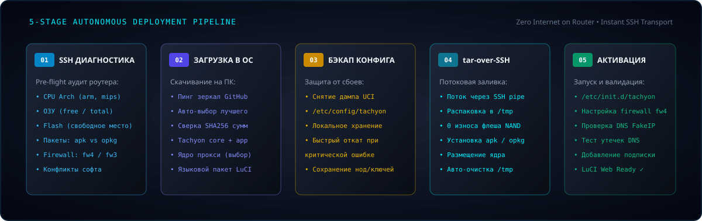

<div align="center">



[](https://go.dev/)
[](https://github.com/Dushnilin/tachyon-installer/releases)
[](https://github.com/Dushnilin/tachyon-installer/releases)
[](https://openwrt.org/)
[](https://t.me/tachyon_proxy)
[](LICENSE)

[**🇷🇺 Русский**](README.md) | [**🇬🇧 English**](README.en.md)

</div>

<p align="center">
  
</p>

## ⚡ About The Project

**Tachyon Express Installer** is a standalone, cross-platform desktop utility and interactive Terminal User Interface (TUI) wizard designed for autonomous deployment and pre-flight hardware diagnostics of the **[Tachyon](https://github.com/Dushnilin/tachyon)** ecosystem on **OpenWrt** routers (compatible with 23.05, 24.10, 25.x, and SNAPSHOT).

### 🎯 The Problem It Solves
In restrictive censorship environments, OpenWrt routers frequently **lack direct access to GitHub**, or WAN connectivity is unstable prior to configuring anti-censorship routing. Standard router-side installation scripts (`curl | sh`) often hang or fail under these conditions.

**Tachyon Installer fundamentally eliminates this barrier:**
1. The installer runs locally **on your workstation** (Windows, Linux, macOS).
2. It fetches all necessary packages, LuCI web interfaces, and proxy core binaries through fast, verified GitHub mirrors.
3. Automatically validates integrity using **SHA256 checksums**.
4. Profiles router hardware over the local SSH network, backs up existing configurations, and **streams payloads directly into RAM (`/tmp`)**, ensuring zero NAND flash wear and completely autonomous installation.

<p align="center">
  
</p>

## 🔄 Deployment Architecture & Pipeline

<div align="center">



</div>

The installation executes across 5 autonomous stages:

1. **🔍 Pre-Flight Router Audit**:
   - Hardware detection: Router model, OpenWrt version, CPU architecture normalization (`arm64`, `mipsle`, `mips`, `x86_64`, `armv7`).
   - Package manager detection (`apk` for OpenWrt 25+ / `opkg` for OpenWrt 24 and older).
   - Flash and RAM memory inspection with safety warnings on low-memory routers.
   - Firewall generation check (`fw4` nftables vs legacy `fw3` iptables).
   - Conflicting package detection (`passwall`, `openclash`, `shadowsocksr`, `podkop`, `forkop`, `nextdns`).
2. **🪞 Intelligent Mirror Download (Host-side)**:
   - Automated parallel latency benchmarking across multiple verified GitHub mirrors.
   - Fast failover recovery if an upstream mirror becomes unreachable.
   - Strict SHA256 integrity verification against official release manifests.
3. **💾 Safe Configuration Backup**:
   - Dumps `/etc/config/tachyon` and stores a local backup on the host PC prior to making changes.
4. **📦 tar-over-SSH Streaming**:
   - Streams payload directly into router RAM `tmpfs` (`/tmp/tachyon-install`) via secure SSH pipe.
   - Zero unnecessary flash read/write cycles, preserving NAND storage lifespan.
5. **⚡ Service Activation & Health Verification**:
   - Atomic package installation and placement of the selected routing engine.
   - Validates systemd/procd service status, nftables rules, FakeIP DNS, and leak prevention.
   - Optional 1-click subscription URL testing and configuration.

<p align="center">
  
</p>

## 🚀 Quick Start

### 1. Download Pre-Built Binaries

Grab the executable for your OS from **[GitHub Releases](https://github.com/Dushnilin/tachyon-installer/releases)**:

| Operating System | Architecture | Direct Executable Binary |
| :--- | :--- | :--- |
| **Windows** | x86_64 (64-bit) | `tachyon-installer-windows-amd64.exe` |
| **Windows** | ARM64 | `tachyon-installer-windows-arm64.exe` |
| **Linux** | x86_64 (amd64) | `tachyon-installer-linux-amd64` |
| **Linux** | ARM64 (aarch64) | `tachyon-installer-linux-arm64` |
| **macOS** | Apple Silicon (M1/M2/M3/M4) | `tachyon-installer-darwin-arm64` |
| **macOS** | Intel (x86_64) | `tachyon-installer-darwin-amd64` |

### 2. Run the Installer

Connect your computer to the router via Ethernet (LAN) or home Wi-Fi, and run:

**Windows (PowerShell / Command Prompt):**
```powershell
.\tachyon-installer.exe
```

**Linux / macOS (Terminal):**
```bash
chmod +x ./tachyon-installer
./tachyon-installer
```

Follow the on-screen TUI wizard:
1. Enter router IP (default `192.168.1.1`), SSH port (`22`), and username (`root`).
2. Provide your router admin password.
3. Review the live pre-flight hardware diagnostics summary.
4. Select your preferred proxy engine, Tachyon version, and mirror on the dashboard.
5. Press **«Start Installation»** (`Enter`) to deploy.

<p align="center">
  
</p>

## 🛠️ Building From Source

Requires **Go 1.22+**:

```bash
# Clone the repository
git clone https://github.com/Dushnilin/tachyon-installer.git
cd tachyon-installer

# Build for current host platform
go build -o tachyon-installer .

# Build all 7 cross-platform desktop releases simultaneously
go run scripts/build.go -v 1.0.0
```

Compiled archives along with `sha256sums.txt` will be generated in `dist/`.

<p align="center">
  
</p>

## 📜 License

Licensed under the **GNU General Public License v3.0 (GPL-3.0)**.

* 🛰️ Core Repository: **[Tachyon](https://github.com/Dushnilin/tachyon)**
* 💬 Community & Discussion: **[Tachyon Telegram Channel](https://t.me/tachyon_proxy)**
